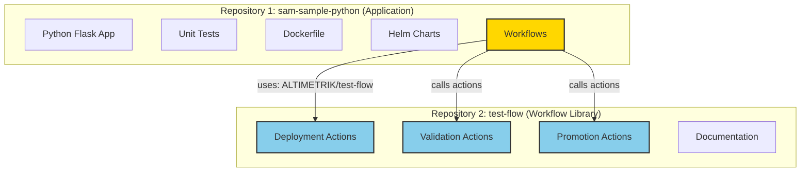
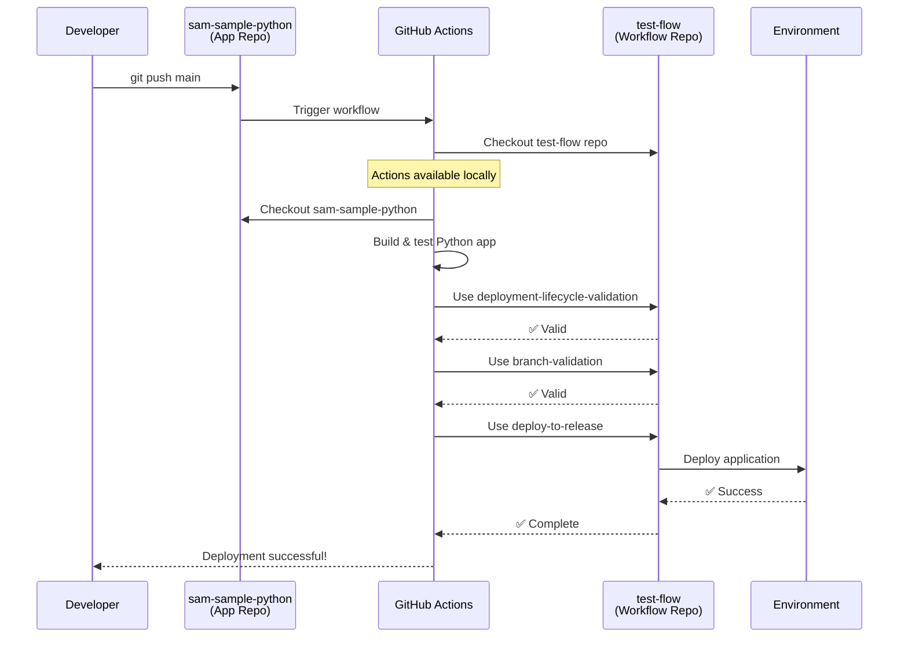

# Two-Repository Architecture

## Overview

This deployment system uses a **two-repository architecture** to separate application code from deployment workflows.

## 🏗️ Architecture Diagram



## 📦 Repository Breakdown

### Repository 1: sam-sample-python (THIS REPO)

**Purpose:** Application code and business logic

```
sam-sample-python/
├── app/                          ← Flask application
│   ├── __init__.py
│   ├── routes.py
│   ├── task_manager.py
│   └── utils.py
├── test/                         ← Unit tests
│   └── test_routes.py
├── deploy/                       ← K8s/Helm configs
│   └── helm/
├── .github/workflows/            ← Workflows that CALL test-flow
│   ├── deploy-to-environments.yml    ← Calls test-flow actions
│   └── promote-app.yml               ← Calls test-flow actions
├── dockerfile                    ← Container definition
├── requirements.txt              ← Python dependencies
└── README.md
```

**Key Point:** The workflows in this repo **reference** actions from test-flow using:

```yaml
- name: Checkout test-flow repository
  uses: actions/checkout@v4
  with:
    repository: ${{ github.repository_owner }}/test-flow  # ← External repo!
    path: test-flow

- name: Run Validation
  uses: ./test-flow/.github/actions/deployment-lifecycle-validation
```

### Repository 2: test-flow (SEPARATE REPO)

**Purpose:** Centralized deployment workflows and reusable actions

```
test-flow/
├── .github/
│   ├── workflows/
│   │   ├── deploy.yml              ← Reference deployment workflow
│   │   └── promote-release.yml     ← Reference promotion workflow
│   └── actions/                    ← Reusable composite actions
│       ├── deployment-lifecycle-validation/
│       │   └── action.yml
│       ├── branch-validation/
│       │   └── action.yml
│       ├── release-check/
│       │   └── action.yml
│       ├── deploy-to-release/
│       │   └── action.yml
│       ├── promotion-validation/
│       │   └── action.yml
│       ├── pre-promotion-checks/
│       │   └── action.yml
│       ├── execute-promotion/
│       │   └── action.yml
│       └── post-promotion-verification/
│           └── action.yml
├── docs/
│   ├── ENVIRONMENT_FLOW.md
│   ├── ENVIRONMENT_DIAGRAM.md
│   └── SETUP_APPROVALS.md
├── VISUAL.md
└── README.md
```

**Key Point:** This repo contains NO application code, only deployment logic that can be used by ANY application.

## 🔄 How They Connect

### Pattern: External Repository Actions

When `sam-sample-python` runs a workflow, it:

1. **Checks out test-flow repository** (external repo)
2. **Checks out sam-sample-python** (itself)
3. **Uses actions from test-flow** via local path reference

```yaml
# In sam-sample-python/.github/workflows/deploy-to-environments.yml

jobs:
  deployment-lifecycle-validation:
    runs-on: ubuntu-latest
    steps:
      # Step 1: Get test-flow repository
      - name: Checkout test-flow repository
        uses: actions/checkout@v4
        with:
          repository: ALTIMETRIK/test-flow    # ← EXTERNAL REPO
          path: test-flow
      
      # Step 2: Get sam-sample-python (current repo)
      - name: Checkout sam-sample-python
        uses: actions/checkout@v4
        with:
          path: sam-sample-python
      
      # Step 3: Use test-flow action
      - name: Run Deployment Lifecycle Validation
        uses: ./test-flow/.github/actions/deployment-lifecycle-validation
        with:
          environment: ${{ inputs.environment }}
          branch: ${{ github.ref_name }}
```

## 🎯 Benefits of This Architecture

### 1. Separation of Concerns
```
Application Repo (sam-sample-python):
├── Business logic
├── Application code
├── Unit tests
└── App-specific configs

Workflow Repo (test-flow):
├── Deployment logic
├── Validation rules
├── Governance policies
└── Workflow standards
```

### 2. Reusability
```
                    ┌─→ sam-sample-python
test-flow actions ──┼─→ another-python-app
                    ├─→ java-microservice
                    └─→ nodejs-api
```

Multiple applications can use the same test-flow actions!

### 3. Centralized Updates
```
Update test-flow once → All apps benefit immediately
```

No need to update deployment logic in every app repo.

### 4. Governance & Compliance
```
test-flow = Single source of truth for:
├── Deployment approvals
├── Security checks
├── Compliance validation
└── Audit requirements
```

### 5. Team Ownership
```
Platform Team owns → test-flow (deployment standards)
App Teams own     → sam-sample-python (business logic)
```

Clear separation of responsibilities.

## 🚀 Workflow Execution Flow



## 📝 Real-World Example

### Scenario: Add a New Security Check

**Before (Without two-repo architecture):**
```
1. Update security check in app1 ❌
2. Update security check in app2 ❌
3. Update security check in app3 ❌
4. Update security check in app4 ❌
... 20 more apps to update ...
```

**After (With two-repo architecture):**
```
1. Update security check in test-flow ✅
2. All apps automatically use new check ✅
```

### Scenario: New App Deployment

**Setup new app:**
```yaml
# In new-app/.github/workflows/deploy.yml
steps:
  - name: Checkout test-flow
    uses: actions/checkout@v4
    with:
      repository: ALTIMETRIK/test-flow
      path: test-flow
  
  - name: Use validation
    uses: ./test-flow/.github/actions/branch-validation
```

**That's it!** Full deployment workflow with all validation gates instantly available.

## 🔐 Security Considerations

### Repository Access

**test-flow (Workflow Library):**
- ✅ Public or internal visibility
- ✅ Platform team has write access
- ✅ App teams have read access

**sam-sample-python (Application):**
- 🔒 Private or internal visibility
- ✅ App team has write access
- ✅ Contains business logic secrets

### No Secrets in test-flow!

```
test-flow                    sam-sample-python
├── No secrets ✅           ├── App secrets 🔒
├── No credentials ✅       ├── Environment vars 🔒
└── Only logic ✅           └── API keys 🔒
```

## 🎓 When to Use This Pattern

### ✅ Use Two-Repo Architecture When:
- Multiple applications need same deployment process
- Platform team manages deployment standards
- Compliance requires centralized control
- You want to enforce consistent validation
- Teams have different access levels (app vs platform)

### ❌ Don't Use When:
- Single application with unique deployment needs
- No reusability requirements
- Small team managing everything
- Rapid prototyping phase

## 🔄 Alternative: Reusable Workflows

GitHub also supports reusable workflows (different from composite actions):

```yaml
# Alternative approach using reusable workflows
jobs:
  deploy:
    uses: ALTIMETRIK/test-flow/.github/workflows/deploy.yml@main
    with:
      environment: prod
```

**Our Approach (Composite Actions) vs Reusable Workflows:**

| Feature | Composite Actions | Reusable Workflows |
|---------|------------------|-------------------|
| Granularity | Individual actions | Entire workflow |
| Flexibility | High - mix and match | Lower - use whole workflow |
| Customization | Easy to customize | Less flexible |
| Debugging | Easier | More complex |
| Our Choice | ✅ Yes | Could also work |

## 📊 Comparison: One Repo vs Two Repos

| Aspect | One Repo | Two Repos (Our Approach) |
|--------|----------|-------------------------|
| **Reusability** | ❌ Copy-paste required | ✅ Use directly from test-flow |
| **Updates** | ❌ Update each app | ✅ Update once in test-flow |
| **Governance** | ❌ Scattered | ✅ Centralized |
| **Complexity** | ✅ Simpler setup | ⚠️ Requires checkout step |
| **Maintenance** | ❌ High effort | ✅ Low effort |
| **Scaling** | ❌ Doesn't scale | ✅ Scales well |

## 🎯 Summary

This two-repository architecture provides:

1. **Clear separation**: App code vs deployment logic
2. **Reusability**: One workflow library, many apps
3. **Maintainability**: Update once, benefit everywhere
4. **Governance**: Centralized deployment standards
5. **Scalability**: Easy to add new applications

The pattern used in `sam-sample-python` calling `test-flow` is an **enterprise-grade approach** for managing deployments across multiple applications!

