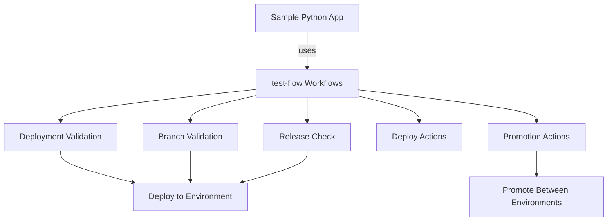

# Sample Python App - Deployment Guide

This application uses the deployment workflows from the `test-flow` repository, implementing the complete deployment lifecycle with validation gates and approvals.

## Architecture Overview



## Deployment Flow Matching the Diagram

This implementation **exactly matches** the flow diagram:

```
GitHub Actions (Deployment Trigger)
           ↓
Deployment Lifecycle Validation
    ↓ (Yes)          ↓ (No)
Branch Validation    Workflow Stops (Failure)
    ↓
Future or Active Release Check
    ↓ (Yes)          ↓ (Check fails)
Deploy to Future Release    Workflow Stops (Failure)
(Duration - Unlimited)
```

### How It Maps:

1. **GitHub Actions (Deployment Trigger)**: `.github/workflows/deploy-to-environments.yml`
2. **Deployment Lifecycle Validation**: Uses `test-flow/.github/actions/deployment-lifecycle-validation`
3. **Branch Validation**: Uses `test-flow/.github/actions/branch-validation`
4. **Future or Active Release Check**: Uses `test-flow/.github/actions/release-check`
5. **Deploy to Future Release**: Uses `test-flow/.github/actions/deploy-to-release`
6. **Workflow Stops (Failure)**: Automatic failure handling at each validation gate

## Workflows

### 1. Deploy to Environments (`deploy-to-environments.yml`)

**Triggers:**
- **Automatic**: Push to `main` → deploys to DEV-INT
- **Manual**: Workflow dispatch to any environment

**Jobs:**
1. ✅ Build & Test Python App
2. ✅ Deployment Lifecycle Validation (from test-flow)
3. ✅ Branch Validation (from test-flow)
4. ✅ Future or Active Release Check (from test-flow)
5. ✅ Build Docker Image
6. ✅ Deploy to Environment (from test-flow)

**Usage:**
```bash
# Auto-deploy to DEV-INT
git push origin main

# Manual deploy to FUTURE
gh workflow run deploy-to-environments.yml \
  -f environment=future \
  -f release_type=future

# Manual deploy to ACTIVE
gh workflow run deploy-to-environments.yml \
  -f environment=active \
  -f release_type=active
```

### 2. Promote App (`promote-app.yml`)

**Triggers:**
- Manual workflow dispatch only

**Jobs:**
1. ✅ Validate Promotion (from test-flow)
2. 🔐 Approval Gate (GitHub environments)
3. ✅ Pre-Promotion Checks (from test-flow)
4. ✅ Execute Promotion (from test-flow)
5. ✅ Post-Promotion Verification (from test-flow)

**Usage:**
```bash
# Promote from ACTIVE to UAT
gh workflow run promote-app.yml \
  -f release_id=active-20250110-120000 \
  -f source_environment=active \
  -f target_environment=uat

# Promote from STAGING to PROD
gh workflow run promote-app.yml \
  -f release_id=staging-20250110-120000 \
  -f source_environment=staging \
  -f target_environment=prod
```

## Environment Flow

```
┌──────────────────────────────────────────┐
│         SAMPLE PYTHON APP                │
│                                          │
│            PROD (2+ approvals)           │
│              ▲                           │
│              │                           │
│  FUTURE → ACTIVE → STAGING (1 approval) │
│              ▲         ▲                 │
│              │         │                 │
│         PARTNER/UAT (1 approval)         │
│              ▲                           │
│              │                           │
│         DEV-INT (main - auto-deploy)    │
└──────────────────────────────────────────┘
```

## Application Structure

```
sample-python/
├── app/
│   ├── __init__.py          # Flask app factory
│   ├── routes.py            # API routes
│   ├── task_manager.py      # Business logic
│   └── utils.py             # Utilities
├── test/
│   ├── __init__.py
│   └── test_routes.py       # Unit tests
├── deploy/
│   └── helm/                # Kubernetes Helm charts
├── .github/
│   └── workflows/
│       ├── deploy-to-environments.yml  # Main deployment
│       └── promote-app.yml             # Promotion workflow
├── dockerfile               # Docker image definition
├── requirements.txt         # Python dependencies
└── run.py                   # Application entry point
```

## How Test-Flow Actions Are Used

### Composite Action Pattern

Each test-flow action is used via checkout and local action reference:

```yaml
steps:
  # 1. Checkout test-flow repository
  - name: Checkout test-flow repository
    uses: actions/checkout@v4
    with:
      repository: ${{ github.repository_owner }}/test-flow
      path: test-flow

  # 2. Checkout sample-python
  - name: Checkout sample-python
    uses: actions/checkout@v4
    with:
      path: sample-python

  # 3. Use test-flow action
  - name: Run Validation
    uses: ./test-flow/.github/actions/deployment-lifecycle-validation
    with:
      environment: ${{ inputs.environment }}
      branch: ${{ github.ref_name }}
```

### Actions Used from test-flow:

1. **deployment-lifecycle-validation** - Validates deployment timing and prerequisites
2. **branch-validation** - Validates branch rules per environment
3. **release-check** - Checks for valid future/active release
4. **deploy-to-release** - Executes deployment
5. **promotion-validation** - Validates promotion paths
6. **pre-promotion-checks** - Comprehensive pre-promotion validation
7. **execute-promotion** - Executes promotion between environments
8. **post-promotion-verification** - Verifies promotion success

## Example Scenarios

### Scenario 1: Feature Development & Auto-Deploy

```bash
# 1. Create feature branch
git checkout -b feature/add-new-api

# 2. Develop and test
# ... make changes ...
pytest test/

# 3. Create PR
gh pr create --base main --title "Add new API endpoint"

# 4. After review, merge PR
gh pr merge --squash

# 5. ✅ Automatically deploys to DEV-INT
# Check Actions tab to see workflow run
```

### Scenario 2: Deploy to FUTURE Environment

```bash
# 1. Create release branch
git checkout -b release/v1.2.0

# 2. Trigger deployment to FUTURE
gh workflow run deploy-to-environments.yml \
  -f environment=future \
  -f release_type=future

# 3. Monitor deployment
gh run list --workflow=deploy-to-environments.yml

# 4. Test in FUTURE environment
curl https://future.example.com/health
```

### Scenario 3: Promote to Production

```bash
# 1. Verify release in STAGING
curl https://staging.example.com/health

# 2. Trigger promotion (requires 2+ approvals)
gh workflow run promote-app.yml \
  -f release_id=staging-20250110-120000 \
  -f source_environment=staging \
  -f target_environment=prod

# 3. Workflow pauses for approvals
# Reviewers approve in GitHub UI

# 4. After approvals, deployment proceeds automatically

# 5. Verify in production
curl https://prod.example.com/health
```

## Validation Gates

Each deployment goes through the following gates (matching the diagram):

### Gate 1: Deployment Lifecycle Validation ✅
- Checks deployment window
- Validates prerequisites
- Verifies no blocking deployments

### Gate 2: Branch Validation ✅
- dev-int: Only `main` branch
- future/active: `main` or `release/*` branches
- uat/staging/prod: `main` or `release/*` branches

### Gate 3: Future or Active Release Check ✅
- For future/active environments only
- Validates release availability
- Checks release schedule

### Final: Deploy to Environment ✅
- Builds application
- Creates Docker image
- Deploys to target environment
- Runs smoke tests

## Failure Handling

Following the diagram, failures at any gate stop the workflow:

```
❌ Lifecycle Validation Fails → Workflow Stops
❌ Branch Validation Fails → Workflow Stops  
❌ Release Check Fails → Workflow Stops
✅ All Pass → Deploy to Environment
```

## Testing the Flow

### 1. Test Auto-Deploy
```bash
echo "# test change" >> README.md
git add README.md
git commit -m "test: trigger auto-deploy"
git push origin main
```

### 2. Test Manual Deploy
```bash
gh workflow run deploy-to-environments.yml \
  -f environment=future \
  -f release_type=future
```

### 3. Test Promotion
```bash
gh workflow run promote-app.yml \
  -f release_id=test-release-001 \
  -f source_environment=active \
  -f target_environment=uat
```

## Monitoring

### View Workflow Runs
```bash
# All deployment workflows
gh run list --workflow=deploy-to-environments.yml --limit 10

# All promotion workflows
gh run list --workflow=promote-app.yml --limit 10

# Watch specific run
gh run watch <run-id>
```

### Check Environment Status
```bash
# List deployments per environment
gh api repos/:owner/:repo/deployments \
  | jq '.[] | {environment, ref, created_at}'
```

## Configuration

### Environment Secrets

Each environment should have:
- `AWS_ACCESS_KEY_ID`
- `AWS_SECRET_ACCESS_KEY`
- `DOCKER_REGISTRY_URL`
- `KUBECONFIG` or `K8S_CLUSTER_URL`

### Environment Variables

- `API_URL` - Environment-specific API endpoint
- `LOG_LEVEL` - Logging level (debug/info/warn/error)
- `DATABASE_URL` - Database connection string

## Troubleshooting

### Deployment Stuck at Validation
```bash
# Check validation logs
gh run view <run-id> --log

# Common issues:
# - Wrong branch for environment
# - Deployment window closed
# - Previous deployment not complete
```

### Promotion Waiting for Approval
```bash
# Check approval status
gh run view <run-id>

# Verify reviewers have access
# Check environment protection rules in Settings → Environments
```

### Build Failures
```bash
# Check test results
pytest test/ -v

# Check Docker build
docker build -t sample-python:test -f dockerfile .

# Check Python dependencies
pip install -r requirements.txt
```

## Benefits of This Architecture

✅ **Separation of Concerns**: App code separated from deployment logic  
✅ **Reusable Workflows**: test-flow can be used by multiple apps  
✅ **Centralized Validation**: All apps follow same deployment rules  
✅ **Easy Updates**: Update test-flow once, all apps benefit  
✅ **Consistent Process**: Same flow for all applications  
✅ **Audit Trail**: Complete history in test-flow repository  

## Next Steps

1. ✅ Set up GitHub environments
2. ✅ Add environment secrets
3. ✅ Configure approval reviewers
4. 📝 Customize deployment logic for your infrastructure
5. 📝 Add monitoring and alerting
6. 📝 Set up rollback procedures

