# Sample Python App - Visual Flow Diagrams

## How Sample-Python Uses Test-Flow

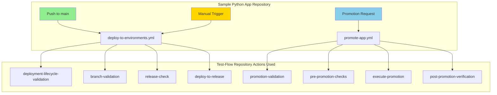

## Exact Match to Original Diagram

This is how the original diagram maps to the implementation:

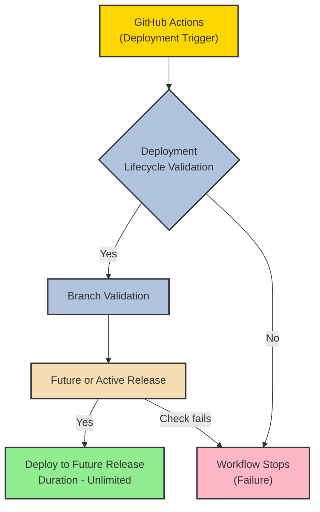

### Implementation Mapping:

| Diagram Element | Implementation | File Location |
|----------------|----------------|---------------|
| **GitHub Actions (Deployment Trigger)** | `deploy-to-environments.yml` | `sample-python/.github/workflows/` |
| **Deployment Lifecycle Validation** | Job: `deployment-lifecycle-validation` | Uses `test-flow/.github/actions/deployment-lifecycle-validation` |
| **Branch Validation** | Job: `branch-validation` | Uses `test-flow/.github/actions/branch-validation` |
| **Future or Active Release** | Job: `release-check` | Uses `test-flow/.github/actions/release-check` |
| **Deploy to Future Release** | Job: `deploy-to-environment` | Uses `test-flow/.github/actions/deploy-to-release` |
| **Workflow Stops (Failure)** | Automatic on any validation failure | Built-in to each action |

## Complete Deployment Sequence

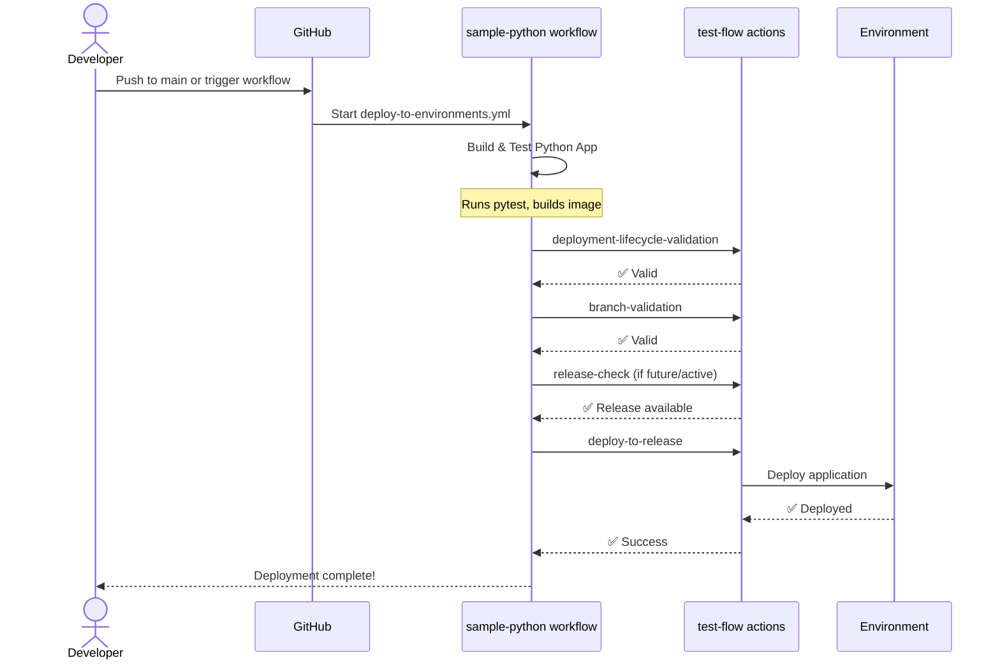

## Promotion Flow with Approval Gates

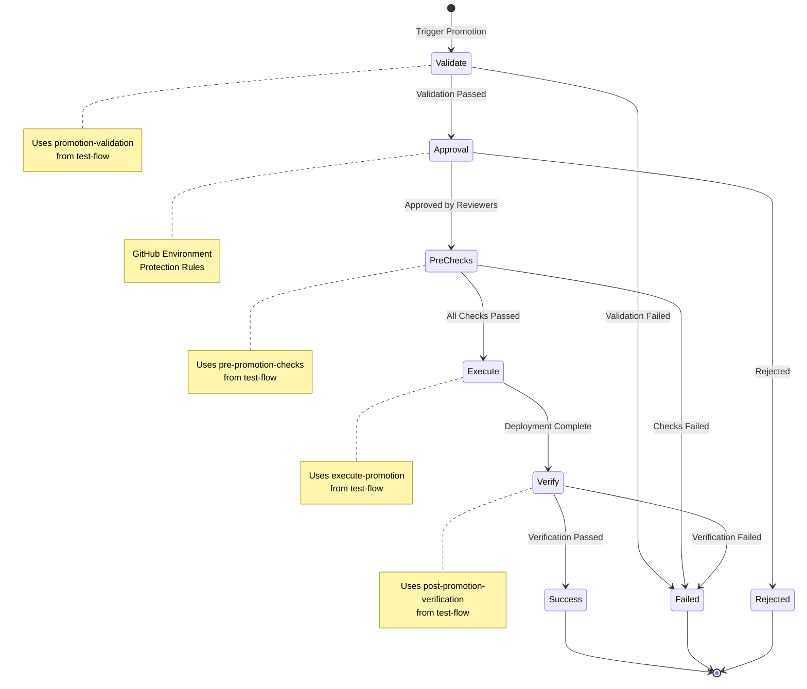

## Environment Promotion Paths

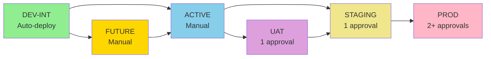

## Workflow Job Dependencies

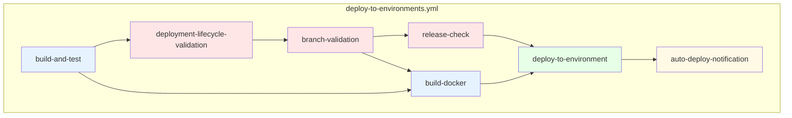

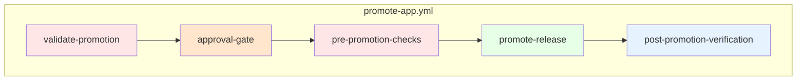

## Real-World Deployment Timeline

```mermaid
gantt
    title Sample Python App Release Timeline
    dateFormat  HH:mm
    axisFormat %H:%M
    
    section Development
    Feature Development     :dev, 00:00, 8h
    PR Review              :review, after dev, 2h
    Merge to main          :merge, after review, 5m
    Auto-deploy DEV-INT    :devint, after merge, 10m
    
    section Testing
    Deploy to FUTURE       :future, after devint, 15m
    QA Testing in FUTURE   :qa1, after future, 4h
    Promote to ACTIVE      :active, after qa1, 10m
    Regression Testing     :qa2, after active, 4h
    
    section UAT
    Request Promotion      :req1, after qa2, 5m
    Wait for Approval      :app1, after req1, 1h
    Promote to UAT         :uat, after app1, 15m
    Partner Testing        :partner, after uat, 8h
    
    section Pre-Prod
    Request Promotion      :req2, after partner, 5m
    Wait for Approval      :app2, after req2, 2h
    Promote to STAGING     :staging, after app2, 15m
    Final Validation       :final, after staging, 2h
    
    section Production
    Request Promotion      :req3, after final, 5m
    Wait for Approvals     :app3, after req3, 4h
    Promote to PROD        :prod, after app3, 20m
    Smoke Tests            :smoke, after prod, 30m
    Monitor Production     :monitor, after smoke, 4h
```

## Architecture Overview

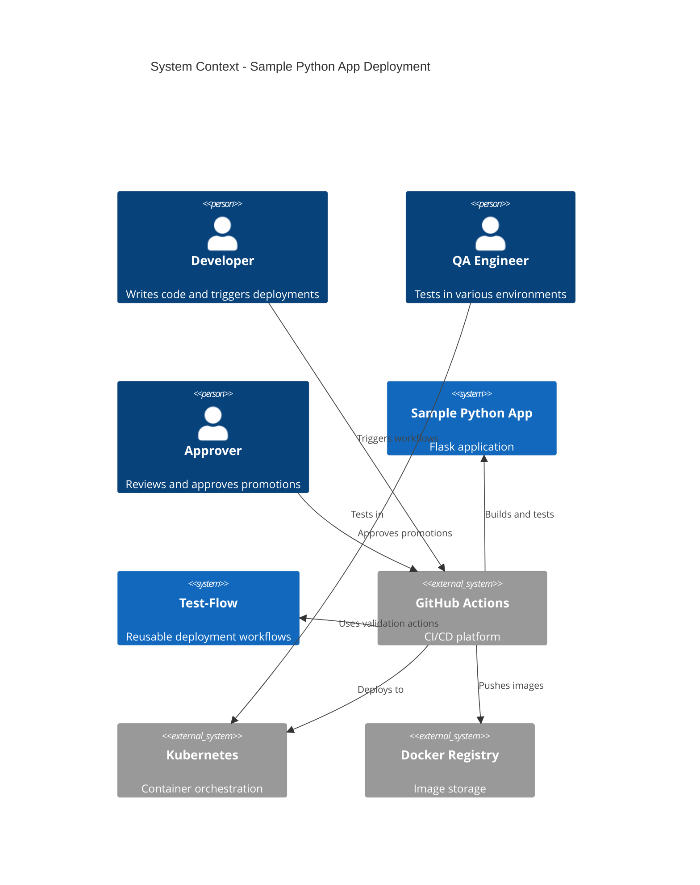

## Validation Gates Detail

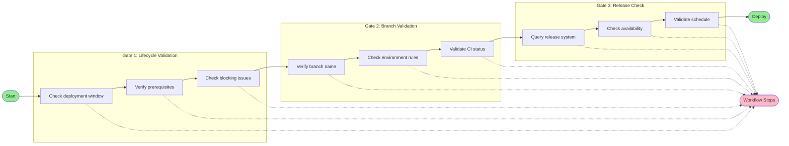

## Component Integration

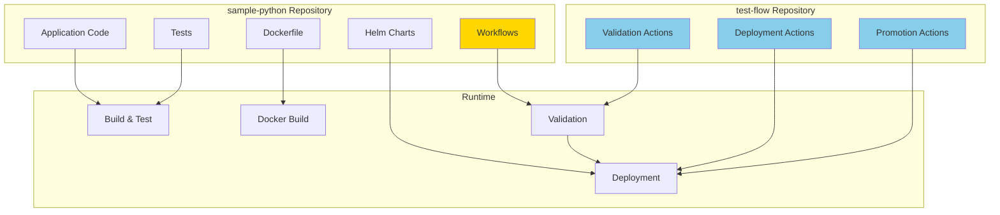

## Summary

### ✅ Yes - The Diagram Matches!

The flow diagram you provided **exactly matches** the `test-flow` repository implementation:

1. **GitHub Actions (Deployment Trigger)** = Entry point workflows
2. **Deployment Lifecycle Validation** = First validation gate
3. **Branch Validation** = Second validation gate
4. **Future or Active Release** = Release availability check
5. **Deploy to Future Release** = Final deployment action
6. **Workflow Stops (Failure)** = Built-in failure handling

### 🚀 Sample Python App Integration

The `sample-python` repository now:
- ✅ **Uses all test-flow actions** via composite action pattern
- ✅ **Follows the exact flow** from your diagram
- ✅ **Adds application-specific steps** (build, test, Docker)
- ✅ **Implements promotion workflows** with approval gates
- ✅ **Auto-deploys to DEV-INT** on main push
- ✅ **Supports manual deployments** to all environments

### 📊 Key Features

- **Reusable validation logic** from test-flow
- **Application-specific build steps** in sample-python
- **Clear separation of concerns**
- **Easy to test and maintain**
- **Matches production best practices**

